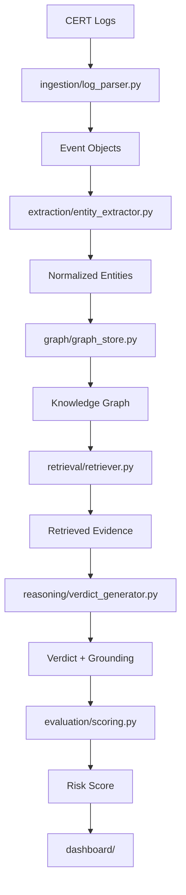

# System Architecture

## Pipeline Overview

The **CyberGraphRAG** system follows a six-stage pipeline for insider threat detection and incident response:

1. **Ingestion** → 2. **Extraction** → 3. **Graph Construction** →
4. **Retrieval** → 5. **Reasoning & Groundedness Check** →
6. **Confidence Scoring & Decision Making** → Dashboard

### 1. Ingestion (ingestion/)
Processes raw security event data from multiple sources:
- **Data Sources**: CERT r4.2/r5.2 datasets, syslog, EDR feeds
- **Format**: CSV, JSON, raw logs with timestamps
- **Processing**: Parse events into Event Pydantic models with normalized fields

### 2. Extraction (extraction/)
Extracts structured information from security events using LLM-powered entity and relationship extraction:
- **LLM Models**: Anthropic Claude/GPT for entity recognition
- **Output**: Normalized entities (User, Host, Process, File, Network) with ATT&CK technique mappings
- **Validation**: Schema validation and confidence scoring for extracted data

### 3. Graph Construction (graph/)
Builds and maintains the knowledge graph using NetworkX:
- **Nodes**: Normalized entities (Users, Hosts, Processes, Files, Networks)
- **Edges**: Relationships between entities (authentication, file access, network connections)
- **Trust Scoring**: Multiplicative confidence scoring with temporal decay
- **Updates**: Incremental graph updates from new security events

### 4. Retrieval (retrieval/)
Routes queries to appropriate data stores based on query type:
- **Structural Retrieval**: Graph-based queries (subgraph traversal, path finding)
- **Semantic Retrieval**: Vector-based search for behavioral anomalies (Chroma/FAISS)
- **Hybrid Retrieval**: Combines both approaches for comprehensive threat analysis

### 5. Reasoning & Groundedness Check (reasoning/)
Synthesizes threat narratives and validates evidence:
- **LLM Reasoning**: Generates behavioral narratives, risk scores, and verdicts
- **Groundedness Check**: Validates explanations against extracted graph evidence
- **Evidence Links**: Maps verdicts to specific graph nodes/edges for auditability

### 6. Confidence Scoring & Decision Making (evaluation/)
Computes risk scores and determines actions:
- **Risk Calculation**: Combines edge trust, temporal decay, and behavioral indicators
- **Action Gating**: Threshold-based automated actions + analyst escalation
- **Partial Confidence**: Explains incomplete evidence for ambiguous cases

### Dashboard (dashboard/)
Real-time visualization and monitoring interface:
- **Graph Visualization**: Interactive network graphs of detected threats
- **Incident Queue**: Prioritized alerts with groundedness scores
- **Analytics**: Real-time statistics and historical trends
- **Control Center**: Manual action execution and analyst workflows

## Technologies & Components

| Component | Technology | Purpose |
|-----------|-----------|---------|
| **Backend** | FastAPI (Python 3.11) | RESTful API with async endpoints |
| **Graph Store** | NetworkX (prod: Neo4j) | Entity relationship storage |
| **Vector Store** | Chroma/FAISS | Semantic similarity search |
| **LLM Integration** | Anthropic/OpenAI | Reasoning and extraction |
| **Data Processing** | pandas, python-dotenv | Data manipulation and config |
| **Frontend** | React + Vite | Real-time dashboard interface |
| **Visualization** | Cytoscape.js/vis-network | Graph display and interaction |
| **Monitoring** | PostgreSQL (audit) | Action trails and compliance |

## Data Flow Example

## System Properties

### Explainability
- **Evidence Tracking**: All decisions linked to graph nodes/edges
- **Groundness Validation**: LLM responses validated against extracted facts
- **Audit Trail**: Complete logs of all events, extractions, and decisions

### Performance
- **Streaming Updates**: Incremental graph updates for real-time processing
- **Query Optimization**: Multi-store retrieval with type-based routing
- **Scalability**: Designed for production with Graph database options

### Security
- **Attack Mapping**: Direct ATT&CK technique identification
- **Behavioral Analysis**: Pattern recognition for insider threats
- **Action Gating**: Automated response with analyst oversight